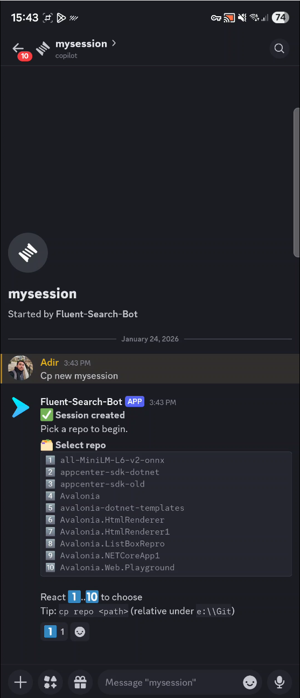
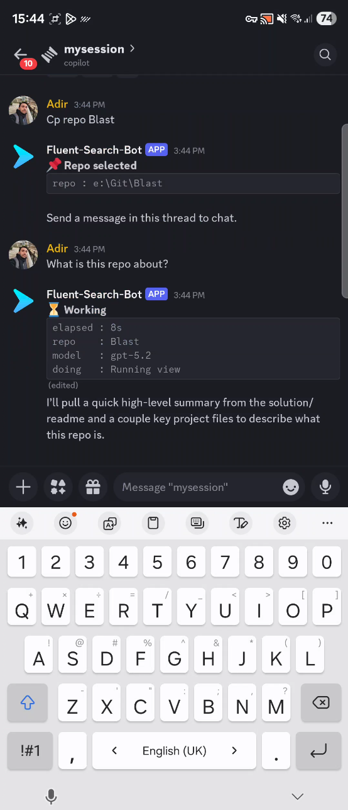
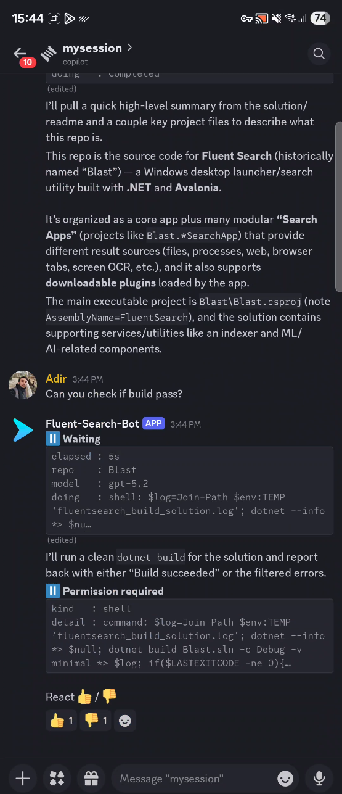

# Copilot Discord Bot — GitHub Copilot on the go

Use GitHub Copilot from your phone by chatting in Discord.

You run this bot on a server/PC (home lab, VM, cloud box) that has:

- GitHub Copilot CLI + authentication
- Your repos under a configured root folder (`REPOS_ROOT`)

Then you use Discord mobile to:

- Create a session (Discord thread)
- Pick a repo with reactions (1..10)
- Approve/deny tool actions with reactions (thumbs up/thumbs down)
- Watch a single "CLI panel" status message update in-place

## Demo







Video: [media/copilot-discord-bot.mp4](media/copilot-discord-bot.mp4)

## Highlights

- **Emoji-first UX**: threads + reactions work great on mobile.
- **Single status panel**: no spam; one message edits in-place.
- **Repo sandbox**: agent work is scoped under `REPOS_ROOT`.
- **Interactive approvals**: prompts show what's being approved.

## Security model (read this)

- Set `OWNER_DISCORD_USER_ID` (recommended). If set, the bot ignores everyone else.
- Keep `REPOS_ROOT` tight. The bot should only see repos you want it to touch.
- Keep approvals on (`cp approve ask`) unless you fully trust your tools + repos.
- Optional: `AUTO_APPROVE_READ_PERMISSIONS=true` reduces prompt spam for read-only actions.

## Prereqs

- Node.js 18 or later
  - Verify: `node --version` should be `18.x` or later
- GitHub Copilot CLI installed on the server and authenticated
  - Verify: `copilot --version` (should not prompt)
  - Authenticate (interactive): run `copilot` once and complete sign-in
  - Authenticate (service-friendly): set `GH_TOKEN` / `COPILOT_GITHUB_TOKEN`
- A Discord application + bot token

## Create a Discord bot + invite it

In the Discord Developer Portal:

1. Create an Application
2. Create a Bot and copy the token
3. Enable **Privileged Gateway Intents**:
   - Message Content Intent (required)
4. Invite the bot to your server (OAuth2 -> URL Generator):
   - Scopes: `bot`
   - Permissions (minimum recommended):
     - View Channels
     - Send Messages
     - Read Message History
     - Create Public Threads
     - Send Messages in Threads
     - Add Reactions
     - Use External Emojis (optional)

## Configure

Copy `.env.example` to `.env` and fill in the values:

```sh
cp .env.example .env
```

Required variables:

- `DISCORD_BOT_TOKEN` — your bot token
- `OWNER_DISCORD_USER_ID` — your Discord user ID (recommended)
- `REPOS_ROOT` — root folder containing repos (example: `/home/user/git`)

All configuration variables (with defaults):

| Variable | Default | Description |
|---|---|---|
| `DISCORD_BOT_TOKEN` | _(required)_ | Discord bot token |
| `OWNER_DISCORD_USER_ID` | _(optional)_ | Only this user can control the bot |
| `REPOS_ROOT` | _(required)_ | Root folder of all repos |
| `DATA_DIR` | `data` | SQLite + Copilot session state directory |
| `DEFAULT_MODEL` | `gpt-5` | Default Copilot model |
| `COPILOT_CLI_PATH` | _(uses PATH)_ | Explicit path to Copilot CLI |
| `DEFAULT_AUTO_APPROVE_PERMISSIONS` | `false` | Auto-approve all permission requests |
| `AUTO_APPROVE_READ_PERMISSIONS` | `true` | Auto-approve read-only requests |
| `TURN_TIMEOUT_SECONDS` | `900` | Seconds before a turn times out |
| `DEBUG_PERMISSION_PAYLOAD` | `false` | Show debug info in permission prompts |
| `PORT` | `5000` | HTTP server port |
| `HOST` | `127.0.0.1` | HTTP server host |

## Run (dev)

From repo root:

```sh
npm install
npm run dev
```

Health endpoint:

- `http://localhost:5000/health`

## Build

```sh
npm run build
npm start
```

## Install as a background service (recommended)

These scripts build the app, set environment variables, and register an always-on service.

### Windows (Windows Service)

Run from an **elevated PowerShell**:

```powershell
powershell -ExecutionPolicy Bypass -File .\scripts\install-service-windows.ps1
```

Common options:

- `-ReposRoot "E:\Git"`
- `-OwnerDiscordUserId 123456789012345678`
- `-GhToken "..."` (recommended for services)
- `-CopilotCliPath "C:\Path\to\copilot.exe"`

Uninstall:

```powershell
powershell -ExecutionPolicy Bypass -File .\scripts\uninstall-service-windows.ps1
```

### Linux (systemd)

Make scripts executable and run with sudo:

```sh
chmod +x scripts/*.sh
sudo ./scripts/install-service-linux.sh --user <username> --repos-root /path/to/repos
```

The installer builds the project, copies output to the install directory, writes an env file at `/etc/copilot-discord-bot.env` (mode 600) and creates a systemd unit.

Uninstall:

```sh
sudo ./scripts/uninstall-service-linux.sh --remove-env
```

## Use it (emoji-first)

### Create a session

In any normal text channel:

- `cp new my-session`

The bot creates a **thread** (that thread is the session) and posts a repo picker.

### Pick a repo

In the session thread:

- React with **1..10** on the repo picker message.

Fallback: `cp repo <path>`

### Chat

Just send normal messages in the thread.

You will see a single status panel updated in-place (state/repo/model/doing).

### Change model

In the session thread:

- `cp model` (shows current)
- `cp model gpt-5.2` (sets for this session)

### Approve/Deny tool actions

When Copilot requests permission, the bot posts a prompt message.

- React **thumbs up** to approve
- React **thumbs down** to deny

## Troubleshooting

### Copilot runtime failed to start

This usually means the `copilot` process exited immediately (often because PATH resolved to a VS Code shim that prints an interactive install prompt).

- Run `which copilot` (Linux/Mac) or `where copilot` (Windows) and verify it points to the installed `copilot` binary
- Run `copilot --version` in the same shell you launch the bot from
- If it prompts to install/reinstall, restart your terminal (PATH update) and try again
- If it still points to a shim, set `COPILOT_CLI_PATH` to the full binary path

### Permission prompt too vague

The Copilot SDK is in preview and permission payload fields can vary. Enable:

- `DEBUG_PERMISSION_PAYLOAD=true`

This adds a debug panel to permission prompts.

### Auto-approve policy (per session)

- `cp approve ask` (recommended)
- `cp approve always`

### MCP server example

Enable the GitHub MCP server for a session:

```
cp config set {"model":"gpt-5.2","mcpServers":{"github":{"type":"http","url":"https://api.githubcopilot.com/mcp/","tools":["*"]}}}
```
